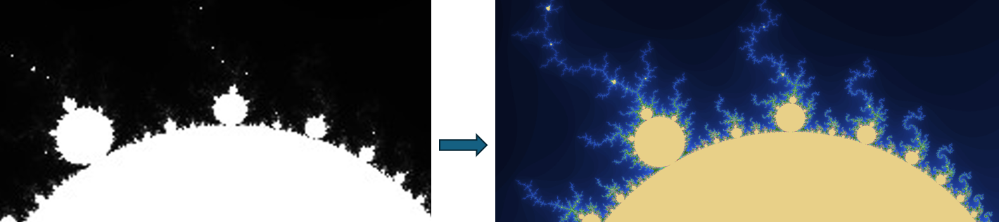

<!-- Your Project title, make it sound catchy! -->

# A C++ Exploration of the Mandelbrot Set and the Use of Scientific Visualization Tools

<!-- Provide a short description to your project -->

## Description

The Mandelbrot set[^1] is a well-known mathematical set, celebrated for its intricate, infinitely complex patterns that repeat at every scale. Since its popularization in the 1980s and 1990s, it has introduced new perspectives in mathematical visualization and complexity, with close links to other fields such as turbulence and computer graphics among others[^2]. This project, *"A C++ Exploration of the Mandelbrot Set and the Use of Scientific Visualization Tools"*, uses the visuals of the set to introduce students to key concepts in scientific computing.

The goal of this ReCoDe (Research and Code Development) project is to help students immerse themselves in computational methods by using the Mandelbrot set as a practical example. This approach aims to make abstract concepts more accesible and engaging. The skills acquired from this project are especially helpful for those involved in high-performance computing (HPC), grid computing, and rapid computation, allowing students to apply their knowledge to fields that require handling complex data,efficient computation and scientific visualization. `C++` is chosen for this project because it is widely used in legacy codes that PhD students need to master and adapt quickly. 

*Figure 1: The main goal of the ReCoDe project is to learn how to generate a high-quality fractal image and reach higher fidelity without increasing the computation time.*

## Project Overview
This project is divided into three sections, which will cover the following points:

### Basic Mandelbrot Set Calculation

In this first section of the ReCoDe project, you will learn how to generate and perform operations on a 2D grid, transfer results directly to a high-quality picture format, and visualize them using tools like VTK. We will explore how to run iterations and inner loops efficiently using the STL (Standard Template Library) library. Additionally, you will receive guidance on measuring computation time with the `chrono` function and using a Makefile to streamline code compilation.

### Optimization Techniques

In this subsection, we will focus on improving the performance of the code from the first part by reducing its runtime through various multithreading paradigms and parallelization techniques all within the STL library. Specifically, we will explore using `std::thread`modifying the code to optimize its performance with these tools. We will demonstrate how these changes can reduce runtime by one-third. Additionally, you will learn how to parallelize the code for distributed-memory computer architectures, such as those used in HPC systems like CX1 and Archer2.

### Visualization Techniques
In this last subsection, we will focus on getting the output file in the VTK format so that we can postprocess it in ParaView and access its features. We will conclude with best practices in scientific vizualization to get a profesional rendered image.

## Learning Outcomes

- Efficiently manipulate large 2D arrays (representing pixels of an image) using `std::vector` to store and process image data.
- Use complex numbers for mathematical computations.
- Implement nested loops to traverse and manipulate two-dimensional data structures.
- Use of STL headers such as `<iostream>`, `<complex>`, `<fstream>`, `<vector>`, and `<chrono>`.
- Learn the `std::thread` multithreading paradigm.
- Synchronization and Communication in MPI.
- Output `C++` computational results directly into PPM (Portable Pixmap) and VTK (Visualization Toolkit) format files for image visualization. This includes extrusion to generate a 3D file.
- Important features of scientific visualization in Paraview.
- Best practices.

| Task       | Time    |
| ---------- | ------- |
| Reading    | 3 hours |
| Practising | 7 hours |

## Requirements
This project does not require prior knowledge of `C++` as there is an effot to explain each segment in detail to ensure the main ideas are clear. It is designed for readers familiar with Fortran, Matlab, or Python to learn the specifics of `C++`. The main goal is for readers to take the functions used here and apply them to their own problems.

## System
Installation instructions will be provided as needed. Except for a few cases, the project mainly uses features from the Standard Library. Some of the figures in the visualization section have been achieved using a 64BG RAM working station: however the reader can apply the same techniques on a much lower resolution image.

## Getting Started
To get started, it is best to first understand how the Mandelbrot set is defined (there is a brief introduction included) and how it is implemented in the code, then move on from there.

**References**

[^1]: Mandelbrot, B. B. (1980). *The Fractal Geometry of Nature*. New York: W.H. Freeman and Co.
[^2]: Barnsley, M. F. (1988). *Fractals Everywhere*. Academic Press, Inc.

## License

This project is licensed under the [BSD-3-Clause license](LICENSE.md)

