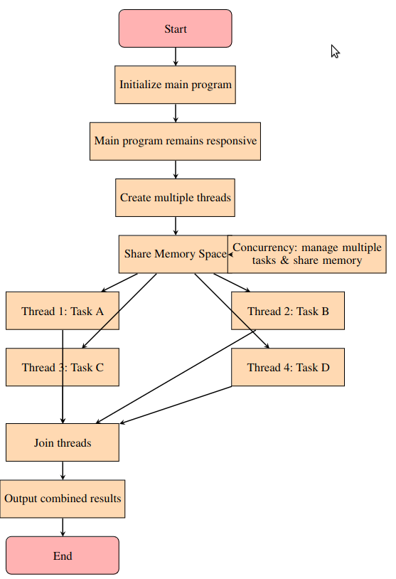

Multithreading  refers to the ability of a CPU (or a single core) to provide multiple threads of execution concurrently. Threads are the smallest parts of a program that can be managed by the operating system. In multithreading, multiple threads use the same memory but can run independently. This allows them to do different tasks or parts of a task at the same time which can make I/O-bound programs more efficient or help keep user interfaces responsive. This means they can do different jobs or parts of a job at the same time. Multithreading allows the main program to remain responsive while background tasks execute. In this context, *concurrency* is the ability of a system to manage multiple tasks at the same time, but not always at the exact same moment.




*Figure 1: Figure: Diagram showing a Multithreaded execution.*


This code generates a high-resolution image of the Mandelbrot set using multithreading for faster computation concurrently. The code uses thread-based multithreading `<thread>` library. Specifically, it creates multiple threads, where each thread is assigned a portion of the Mandelbrot set computation (a range of rows of the image). This form of multithreading allows multiple parts of the task to run concurrently on different CPU cores, thus speeding up the overall computation.

Each thread runs the `computeMandelbrotRows` function independently, processing its assigned rows of the image. Once all threads finish, the main program waits for them to complete using `thread.join()`. This type of multithreading is useful because of the use of multiple CPU cores efficiently.

## Mandelbrot set function only to compute a certain number of rows

```cpp
void computeMandelbrotRows(std::vector<int>& iterations, int startRow, int endRow) {
    for (int y = startRow; y < endRow; ++y) {
        for (int x = 0; x < X; ++x) {
            double real = X_MIN + (X_MAX - X_MIN) * x / (X - 1);
            double imag = Y_MIN + (Y_MAX - Y_MIN) * y / (Y - 1);
            std::complex<double> c(real, imag);
            std::complex<double> z(0.0, 0.0);

            int iter;
            for (iter = 0; iter < MAX_ITER; ++iter) {
                if (std::abs(z) > 2.0) break;
                z = z * z + c;
            }

            iterations[y * X + x] = iter;
        }
    }
}
```


**Function configuration:**  
The primary function of `computeMandelbrotRows` is to calculate the Mandelbrot set for a specific range of rows in the 2D pixel grid, storing the results in a given vector of integers. Note that `void` is used here to indicate that the function does not return any value. It directly modifies the contents of the `iterations` vector passed by reference. Since the goal of the function is to update the state of the `iterations` vector rather than produce a new result to be returned, a `void` return type is appropriate. This is quite commonly used in C++ when you want to perform actions rather than compute a value.

Also, by using a reference parameter (`std::vector<int>& iterations`), the function can modify the contents of the vector without the overhead of copying it. This approach avoids unnecessary memory usage. Note the use of `&`, which is the symbol that allows the function to accomplish that.

The range of the function is specific and does not include the whole 2D grid. `int startRow` is the starting row index for the computation, and `int endRow` is the ending row index (exclusive).

**Nested loop:**  
The main idea is that `computeMandelbrotRows` iterates from `startRow` to `endRow`, allowing threads to operate on different segments without overlap. The commands for mapping the image coordinates, creating the complex number, applying the Mandelbrot formula, and storing the iterations count are exactly the same as in the single-threaded version. We are also not timing anything here, as this function will be called concurrently.


## General Mandelbrot set function that uses multithreading

The `computeMandelbrotParallel()` function uses multithreading to compute the Mandelbrot set efficiently. It achieves this by dividing the workload among the available CPU threads. These threads enhance performance and reduce computation time. Each thread is assigned a specific range of rows to process, allowing multiple calculations to occur simultaneously. The keyword here is concurrent execution within a single process. Additionally, the function employs `std::vector` to manage the results and `std::thread` to facilitate parallel execution. This ensures that the data is handled effectively during the computation process.

```cpp
std::vector<int> computeMandelbrotParallel() {
    std::vector<int> iterations(X * Y);

    int numThreads= std::thread::hardware_concurrency();
    
    std::vector<std::thread> threads; //Empty vector
    threads.reserve(numThreads); // Reserve option

    int rowsPerThread = Y / numThreads;

    for (int i = 0; i < numThreads; ++i) {
        int startRow = i * rowsPerThread;
        int endRow = (i == numThreads - 1) ? Y : (i + 1) *rowsPerThread;
        threads.emplace_back(computeMandelbrotRows, std::ref(iterations),startRow,endRow);// Add new threads one by one to the vector as you create them
    }
    //Command needed, similar to MPI_Allreduce or MPI_GATHER
    for (auto& thread : threads) {
        thread.join();
    }

    return iterations;
}
```


**Function configuration and vector initialization:**

The `computeMandelbrotParallel()` function returns a `std::vector<int>` that stores the number of iterations for each pixel in the Mandelbrot set computation. Here, the function does not take any parameters `()` because we design it to focus on computing the Mandelbrot set globally. For this reason, it does not require any additional input from the caller. 

Following this, we initialized a vector called `iterations` with a size equal to the total number of pixels in the image (`X * Y`), just like we did in the original code. `return iterations;` enables the computed iteration counts from the Mandelbrot set calculation to be returned to the calling function. This allows for further processing or output of the results. 

**Determine number of threads and thread vector initialization**

We need to determine the number of concurrent threads that the hardware (CPU) can support. The function `std::thread::hardware_concurrency()` returns the number of threads that the implementation can run concurrently. We will use `numThreads` in the calculations.

Following this, we need to declare a vector named `threads` to hold the threads that will be created. `std::vector<std::thread> threads;` declares an empty vector named `threads` that will store objects of type `std::thread`. This is the same vector that we have been using and that is provided by the Standard Library which can grow and shrink in size as needed.


```cpp
std::vector<std::thread> threads; // Empty vector
```


The `reserve(numThreads)` function is called to allocate enough memory for the number of threads which can improve performance by avoiding multiple reallocations as threads are added. This is in some ways similar to allocation in Matlab or Fortran. We access members (functions and variables) of the `threads` object with the `.` operator. The `reserve(size_type n)` function is a member function of the `std::vector` class. Its primary purpose is to allocate memory, and it remains zero until you actually add elements to it.

```cpp
threads.reserve(numThreads); // Reserve option
```

**Calculate Rows-Per-Thread**  
This line calculates the number of rows that each thread will process. It ensures that the workload is distributed evenly among the available threads.


```cpp
int rowsPerThread = Y / numThreads;
```


**Thread loop**  
This loop divides the task of processing rows of an image into chunks. Each thread is assigned a specific range of rows to work on, determined by `startRow` and `endRow`. The `startRow` and `endRow` values define the portion of the total rows that each thread will handle. The last thread is assigned any remaining rows to ensure that all rows are processed. This is important when `Y` (the total number of rows) is not evenly divisible by `numThreads`.


```cpp
for (int i = 0; i < numThreads; ++i) {
        int startRow = i * rowsPerThread;
        int endRow = (i == numThreads - 1) ? Y : (i + 1) * rowsPerThread;
        // Continuation of the body of the function
    }
```
This technique shown in the command is quite commonly used in parallel programming or multithreading to divide a large task into smaller tasks. The line `int startRow = i * rowsPerThread;` calculates the starting row index for each thread. `(i == numThreads - 1)` checks if the current thread `i` is the last thread (since `numThreads - 1` is the index of the last thread in a 0-based index system). `? Y:` uses the ternary operator which basically means `condition ? value_if_true : value_if_false;`. If `i` is the last thread, the `endRow` is set to `Y`. This means the last thread processes all remaining rows up to the end of the dataset. This is done to ensure that the division of work is exact, even if `Y` is not evenly divisible by `numThreads`. If `i` is not the last thread, then `endRow` is set to `(i + 1) * rowsPerThread` which gives the end of the current portion of rows of the thread.

**Threads creation**  
Inside the thread loop, the following line is responsible for creating a new thread and adding it to the `threads` vector. This allows for simultaneous computation of different sections of the Mandelbrot set, speeding up the process.


```cpp
threads.emplace_back(computeMandelbrotRows, std::ref(iterations), startRow, endRow);
```

We access the container that stores thread objects `threads` and we use `emplace_back(...)`. This is a member function of `std::vector` that constructs and adds a new element to the end of the vector. In this case, it constructs a new `std::thread` object. `computeMandelbrotRows` is the name of the function that will be executed by the newly created thread. Each thread will execute this function concurrently.

`std::ref(iterations)` wraps the `iterations` vector in a `std::reference_wrapper`. This is important because the `computeMandelbrotRows` function takes the `iterations` vector by reference (`std::vector<int>& iterations`). Using `std::ref` ensures that the vector is not copied; instead, a reference to the original vector is passed to the thread. This allows multiple threads to modify the same `iterations` vector without creating separate copies which would be inefficient. `startRow` and `endRow` are the starting and ending row indices calculated for each thread. Each thread processes the range of rows assigned to it during computation.

**Joining threads**  
This loop iterates through the `threads` vector and calls `join()` on each thread. This makes the main thread wait for all the created threads to complete their execution before moving forward. The purpose of this is to synchronize the threads.

`for (auto& thread : threads)` is a loop that goes through each thread in the `threads` vector. `auto&` figures out the type of `thread` automatically and makes sure we are working with the actual thread, again avoiding unnecessary copies. The `&` is important because it lets us handle the original `std::thread` objects directly.

In `thread.join()`, the `join()` function is a part of `std::thread` that makes the main thread wait until the thread it is called on has finished running. This means the main thread will not move on until the thread completes its task. If `join()` is not called, the main thread might finish and close the program before the worker threads are done. This can lead to problems like incomplete work or errors. This should always be included at the end of the function.

```cpp
for (auto& thread : threads) {
    thread.join();
}
```


## The caller function

This function, as in the original code, orchestrates the entire program, coordinating various operations. The only difference is that this time it calls the `computeMandelbrotParallel()` function to compute the Mandelbrot set using multiple threads. Also, this is the only function that has timing measurements which are exactly in the same form as in the original code.


## The output
We compile the code as follows.
```
 g++ -std=c++11 -o mandelbrot mandelbrot_set_exploration_std_thread.cpp -pthread
```
Execute the command
```
 ./mandelbrot
```

Here, we print-out the total time spent on scaling coordinates and performing iterations.
```
Width of the image:5000
Height of the image: 5000
Total time taken to compute the Mandelbrot set with Multithreading: 69.5359 seconds
Number of CPUs available: 12
Total time it takes to generate image: 6.30912 seconds
Mandelbrot set with colormap: mandelbrot_gradient.ppm
```
This multithreaded version runs approximately 4.15 times faster than single-threaded version.
