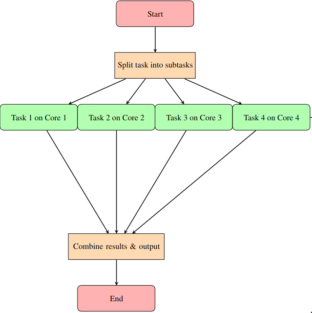

 Parallelism on the other hand, means running multiple tasks or processes at the same time on different CPU cores or machines. It is more a broader idea that includes any situation where tasks are done at the same time. In parallelism, the tasks can work independently and do not need to use the same memory. This can be done in different ways, for example using multi-core CPUs, distributed computing, or parallel processing systems. Parallelism works best for tasks that require a lot of computing power and can be split into independent smaller tasks, like numerical simulations, processing large amounts of data or rendering images. Most important aspect is that this enable us to run our work in HPC clusters.

 <!--<p align="center">
  
  <br>
  <em>Figure: Diagram showing a Paralell execution using MPI.</em>
</p>-->



*Figure: Diagram showing a Paralell execution using MPI.*

This code shows the parallelized version of the single-threaded version using Message Passing Interface (MPI). MPI is a standardized and portable message-passing system (think of a protocol) that helps processes communicate in a distributed computing environment. It allows different processes that run on separate machines to exchange messages and coordinate their actions, making it essential for high-performance computing tasks. In the case that we need to increase the number of processors beyond our workstation or require more RAM than is available, MPI helps distribute the workload across more processes by running tasks in parallel and collecting the results in one place.

We will explain step by step the sections of the code. The computation of different rows of the Mandelbrot set is split among multiple processes. Each process calculates a set of rows based on its rank in the MPI communicator. The `compute_Mandelbrot_equation` function is exactly the same as in the single-threaded version. However, this time `MPI_Gather` collects the results from all processes into a single buffer on the root process (rank 0). The root process then assembles and saves the image in PPM format using `save_ppm`.


```cpp
#include <iostream>
#include <complex>
#include <fstream>
#include <vector>
#include <chrono>
#include <mpi.h>

constexpr int X = 5000;       // Width(X)
constexpr int Y = 5000;       // Height(Y)
constexpr int MAX_ITER = 1000;   // Maximum number of iterations
constexpr double X_MIN = -2.0;   // Maximum x-axis value
constexpr double X_MAX = 1.0;    // Maximum x-axis value
constexpr double Y_MIN = -1.5;   // Maximum y-axis value
constexpr double Y_MAX = 1.5;    // Maximum y-axis value

std::vector<int> compute_Mandelbrot_equation(int start_row,int num_rows) {
    std::vector<int> iterations(num_rows * X);

    for (int y = start_row; y < start_row + num_rows; ++y) {
        for (int x = 0; x < X; ++x) {
            double real = X_MIN + (X_MAX - X_MIN) * x / (X - 1);
            double imag = Y_MIN + (Y_MAX - Y_MIN) * y / (Y - 1);

            std::complex<double> c(real, imag);
            std::complex<double> z(0.0, 0.0);

            int iter;
            for (iter = 0; iter < MAX_ITER; ++iter) {
                if (std::abs(z) > 2.0) break;
                z = z * z + c;
            }
            iterations[(y - start_row) * X + x] = iter;
        }
    }
    return iterations;
}

void save_ppm(const std::vector<int>& iterations, const std::string& filename) {
    std::ofstream ofs(filename, std::ios::binary);

    ofs << "P6\n" << X << " " << Y << "\n255\n";

    for (int i = 0; i < X * Y; ++i) {
        int iter = iterations[i];
        unsigned char r = static_cast<unsigned char>(iter % 256);
        unsigned char g = static_cast<unsigned char>((iter *2) % 256);
        unsigned char b = static_cast<unsigned char>((iter *5) % 256);
        ofs << r << g << b;
    }

    ofs.close();
}
// This is structured/standard MPI input
int main(int argc, char** argv) {
    MPI_Init(&argc, &argv);

    int rank, size;
    MPI_Comm_rank(MPI_COMM_WORLD, &rank);
    MPI_Comm_size(MPI_COMM_WORLD, &size);

    int num_rows = Y / size;
    int start_row = rank * num_rows;
    if ( rank == size - 1) {
        num_rows = Y - start_row; // Last process takes the remaining rows
    }

    std::cout << "Width(X) of the image: " << X  << std::endl;
    std::cout << "Height(Y) of the image: " << Y << std::endl;

    auto start_compute = std::chrono::high_resolution_clock::now();
    std::vector<int> local_iterations = compute_Mandelbrot_equation(start_row, num_rows);
    auto end_compute = std::chrono::high_resolution_clock::now();
    std::chrono::duration<double> elapsed_compute = end_compute -start_compute;
    std::cout << "Process " << rank << " completed in: " << elapsed_compute.count() << " seconds" << std::endl;

    std::vector<int> global_iterations;
    if (rank == 0) {
        global_iterations.resize(X * Y);
    }

    MPI_Gather(local_iterations.data(),num_rows*X,MPI_INT,global_iterations.data(),num_rows*X,MPI_INT,0,MPI_COMM_WORLD);

    if (rank == 0) {
        auto start_save = std::chrono::high_resolution_clock::now();
        save_ppm(global_iterations, "mandelbrot_gradient.ppm");
        auto end_save = std::chrono::high_resolution_clock::now();
        std::chrono::duration<double> elapsed_save = end_save - start_save;
        std::cout << "Time it takes to generate image: " << elapsed_save.count() << " seconds" << std::endl;

        std::cout << "Mandelbrot set with colormap output: mandelbrot_gradient.ppm"<< std::endl;
    }

    MPI_Finalize();
    return 0;
}
```


## The Header

Note that the only additional header is `<mpi.h>`. This header enables parallelism by providing MPI functions needed to split the computation among multiple processes. MPI is not included in the C++ standard library.

MPICH is a popular open-source implementation of the MPI standard. It is built for high performance and works on many types of parallel computing systems, including clusters and supercomputers. On Ubuntu, MPICH can be installed easily as a pre-compiled package from the default software repositories.


```
sudo apt update
sudo apt install mpich libmpich-dev
```
Once the installation is completed, you can check the version of MPICH to confirm the installation as follows,
```
mpirun --version
```

## The Mandelbrot set main computation

The Mandelbrot set main computation `compute_Mandelbrot_equation()` presented below has some changes compared to the single-threaded version. These differences show the change from a simple implementation to a parallelized approach.

```cpp
std::vector<int> compute_Mandelbrot_equation(int start_row, int num_rows) {
    std::vector<int> iterations(num_rows * X);

    for (int y = start_row; y < start_row + num_rows; ++y) {
        for (int x = 0; x < X; ++x) {
            double real = X_MIN + (X_MAX - X_MIN) * x / (X - 1);
            double imag = Y_MIN + (Y_MAX - Y_MIN) * y / (Y - 1);

            std::complex<double> c(real, imag);
            std::complex<double> z(0.0, 0.0);

            int iter;
            for (iter = 0; iter < MAX_ITER; ++iter) {
                if (std::abs(z) > 2.0) break;
                z = z * z + c;
            }
            iterations[(y - start_row) * X + x] = iter;
        }
    }
    return iterations;
}
```


**The Main Function Definition**

In the single-threaded version, `std::vector<int> compute_Mandelbrot_equation()` computed the entire Mandelbrot set in one go, as there are no other processes to communicate with. All calculations for the image size \(X \times Y\) are done in a single function call. The situation is different now because we aim to divide the work between processors. In parallel computing with MPI, each process handles only part of the total data. For this reason, the function is designed to take the starting row `start_row` and the number of rows `num_rows` to process as inputs which helps divide the work between processes.


**Initialisation and declaration of the variables:**
Inside the function, we proceed with the initialisation and declaration of the `iterations` vector.
```cpp
std::vector<int> compute_Mandelbrot_equation(int start_row, int num_rows) {
    std::vector<int> iterations(num_rows * X);
    // Body of the function
    return iterations;
}
```
`num\_rows * X` gives the total number of pixels that need to be stored in the \texttt{iterations} vector for the specific rows assigned to that thread or process. 
```cpp
std::vector<int> iterations(num_rows * X);
```
Each process computes the Mandelbrot set for a subset of the image rows. The image rows `Y` are divided among the available processes (size), where `num_rows` is the number of rows given to each MPI process and `X` remains the total number of columns (width) in the image. Since each process calculates only a portion of the rows, it only needs memory for those specific rows. This reduces memory usage and is important for large images or systems with limited resources. `return iterations;` enables the computed iteration counts from the Mandelbrot set calculation to be returned to the calling function. This allows for further processing or output of the results.


**Partial nested loop:**
In the single-threaded version, the nested loop goes through every pixel in the image sequentially. In this MPI version however, the outer loop processes only the rows assigned to the current MPI process. Note, that the inner loop remains the same because we cover the whole length of the columns.
```cpp
for (int y = start_row; y < start_row + num_rows; ++y) {
    for (int x = 0; x < X; ++x) {
        // The mapping of image coordinates to the complex plane remains the same.
        // The creation of complex numbers and Mandelbrot formula remains also the same.
        
    }
}
```
This is important for balancing the workload particularly in this nested loop which is the critical component of the code in terms of performance, letting each process work on its own part of the image at the same time. The mapping of image coordinates to the complex plane and the creation of complex numbers in the MPI version remains the same as in the single-threaded version because regardless of how many processes are used, the same mapping and use of the same formula ensures that each process computes the Mandelbrot set correctly and produces identical results.


**Storing the iteration count in the vector:** 

Here the same applies. The indexing takes into account the rows processed by the current MPI process, requiring an adjustment based on `start\_row`. Both versions return a vector of iterations, but the MPI version only returns the rows calculated by that specific process, while the single-threaded version returns the entire image data.

## Main MPI function
This is the main MPI function that orchestrates the entire workflow of the program.

```cpp
int main(int argc, char** argv) {
    MPI_Init(&argc, &argv);

    int rank, size;
    MPI_Comm_rank(MPI_COMM_WORLD, &rank);
    MPI_Comm_size(MPI_COMM_WORLD, &size);

    int num_rows = Y / size;
    int start_row = rank * num_rows;
    if ( rank == size - 1) {
        num_rows = Y - start_row; // Last process takes the remaining rows
    }

    std::cout << "Width(X) of the image: " << X  << std::endl;
    std::cout << "Height(Y) of the image: " << Y << std::endl;

    auto start_compute = std::chrono::high_resolution_clock::now();
    std::vector<int> local_iterations = compute_Mandelbrot_equation(start_row, num_rows);
    auto end_compute = std::chrono::high_resolution_clock::now();
    std::chrono::duration<double> elapsed_compute = end_compute -start_compute;
    std::cout << "Process " << rank << " completed in: " << elapsed_compute.count() << " seconds" << std::endl;

    std::vector<int> global_iterations;
    if (rank == 0) {
        global_iterations.resize(X * Y);
    }

    MPI_Gather(local_iterations.data(),num_rows*X,MPI_INT,global_iterations.data(),num_rows*X,MPI_INT,0,MPI_COMM_WORLD);

    if (rank == 0) {
        auto start_save = std::chrono::high_resolution_clock::now();
        save_ppm(global_iterations, "mandelbrot_gradient.ppm");
        auto end_save = std::chrono::high_resolution_clock::now();
        std::chrono::duration<double> elapsed_save = end_save - start_save;
        std::cout << "Time it takes to generate image: " << elapsed_save.count() << " seconds" << std::endl;

        std::cout << "Mandelbrot set with colormap output: mandelbrot_gradient.ppm"<< std::endl;
    }

    MPI_Finalize();
    return 0;
}
```


**Definition of the main function:**  
Exactly as in the single-threaded version, `int` indicates that the function returns an integer. This is used as the exit status of the program. `main` is the name of the function that the operating system calls when the program starts. `int argc` is the argument count and indicates the number of command-line arguments passed to the program. `char** argv` is the argument vector which is an array of C-strings or character arrays representing the actual arguments. There might be more to say about this type of setting; however, it is important to note that in MPI applications, it is common to initialize the MPI environment with `MPI_Init(&argc, &argv)`, ensuring compatibility with the initialization requirements of the MPI library.

`MPI_Finalize()` cleans up the MPI environment and frees any resources used by MPI. This should be the last MPI function called in the program. It is a good practice to include it to avoid memory leaks and other issues. `return 0;` as previously used, indicates that the program finished successfully.

**MPI Initialization:**  
`MPI_Init` sets up the MPI environment. It must be called before using any other MPI functions. By calling `MPI_Init`, you prepare the MPI library for operation. This includes the ability to create and manage processes.

**MPI ranks and sizes:**  
Here, we retrieve and store information about the parallel processes. `rank` is assigned the unique identifier of the calling process (it ranges from 0 to `size` - 1), while `size` holds the total number of processes being used in the program. This information is crucial for coordinating tasks among the processes because it allows each process to know its own identity (`rank`) and how many processes are used in the computation (`size`).

`int rank, size;` declares the two integer variables used for this information. `MPI_Comm_rank` retrieves the rank (ID) of the calling process in the specified communicator (`MPI_COMM_WORLD` includes all processes). The information is stored in the `rank` variable. `MPI_Comm_size` retrieves the total number of processes in the specified communicator and stores it in the `size` variable.


**Distribution of the row for Computation:**  
Here, we divide the workload of generating the Mandelbrot set among multiple processes. It calculates how many rows of the image each process should handle by dividing the total number of rows `Y` by the number of processes (`size`). The variable `start_row` determines the starting row for each process based on its rank. If the process is the last one (indicated by `rank == size - 1`), it adjusts `num_rows` to account for any remaining rows so that all rows of the image are processed, even if the number of rows does not divide evenly among the processes.


```cpp
int num_rows = Y / size;
int start_row = rank * num_rows;
if (rank == size - 1) {
    num_rows = Y - start_row; // Last process takes the remaining rows
}
```

`int num_rows = Y / size;` calculates how many rows of the image each process will compute by dividing the total number of rows `Y` by the number of processes (`size`).

`int start_row = rank * num_rows;` calculates the starting row for the current process based on its rank. For example, process 0 starts at row 0, process 1 starts at `num_rows`, and so on.

`if (rank == size - 1)` checks if the current process is the last one (highest rank). If this is the case, `num_rows = Y - start_row;` adjusts `num_rows` to account for any remaining rows that could not be evenly divided.


**Execution of functions and its timing:**

Here, we measure the time it takes for each MPI process to compute its assigned portion of the Mandelbrot set. The measurement of the time is exactly analogous to what we presented previously. It begins by capturing the current time before the computation using `std::chrono::high_resolution_clock::now()`. Then, it calls the `compute_Mandelbrot_equation` function which performs the actual calculation for the designated rows of the image. After the computation is complete, it captures the end time and calculates the elapsed time.

`compute_Mandelbrot_equation(start_row, num_rows):` Calls the function to compute the Mandelbrot set for the assigned rows. The results are stored in `local_iterations`. The values of `start_row` and `num_rows` are explicitly calculated in the previous steps. Note that here we are also initializing the `local_iterations` vector (`std::vector<int>`).

**Gathering Results and MPI Gather:**

The goal is to gather the results of the set computations from all MPI processes and combine them into a single data structure on the root process. The root process is the process that has the rank of 0 in the communication group. It is the designated coordinator for collective operations. First, an empty vector called `global_iterations` is created to store the combined results. If the current process is the root (rank 0), it resizes `global_iterations` to fit the total number of pixels in the image. This is calculated as `(X * Y)`.

After this, the `MPI_Gather` function is used to collect the individual results stored in `local_iterations` from each process. Each process sends its computed data which is the size of `num_rows * X`, to the root process. The root process then combines all this data into `global_iterations`. This process allows the root to access the complete set of iteration counts for the entire image, making it possible to save the final output as a PPM file.

In other words, the `global_iterations` vector is constructed from `local_iterations` through the `MPI_Gather` function and consolidates it into a single vector on the root process (rank 0).


```cpp
std::vector<int> global_iterations;
if (rank == 0) {
    global_iterations.resize(X * Y);
}
MPI_Gather(local_iterations.data(), num_rows * X, MPI_INT, global_iterations.data(), num_rows * X, MPI_INT, 0, MPI_COMM_WORLD);
```

`MPI\_Gather` follows a structured input form presented below taken directly from MPICH website which we can "fill out" with our inputs.

```cpp
int MPI_Gather(const void *sendbuf,int sendcount,MPI_Datatype sendtype,
               void *recvbuf,int recvcount,MPI_Datatype recvtype,int root,MPI_Comm comm)
```

- **sendbuf**  
  Starting address of the send buffer (choice). Our code: `local_iterations.data()` is the starting address of the send buffer and contains the local computed iterations for the current process. The `.data()` method retrieves a pointer to the underlying array. A pointer is a variable that stores the memory address of another variable.

- **sendcount**  
  Number of elements in the send buffer (integer). Our code: `num_rows * X` specifies the number of elements in the send buffer for each process. This is the number of rows each process computed multiplied by the width of the image (`X`).

- **sendtype**  
  Data type of send buffer elements (handle). Our code: `MPI_INT` indicates the data type of the elements in the send buffer which is an integer.

- **recvbuf**  
  Address of the receive buffer (choice, significant only at root). Our code: `global_iterations.data()` is the starting address of the receive buffer where the gathered data will be stored at the root process (rank 0).

- **recvcount**  
  Number of elements for any single receive (integer, significant only at root). Our code: We repeat again `num_rows * X`. This time it specifies that the root process will expect to receive this many integers from each process.

- **recvtype**  
  Data type of receive buffer elements (significant only at root) (handle). Our code: `MPI_INT` indicates the data type of the elements in the receive buffer which is also an integer.

- **root**  
  Rank of the receiving process (integer). Our code: 0. This is the rank of the root process that will receive the data.

- **comm**  
  Communicator (handle). Our code: `MPI_COMM_WORLD` is the communicator that includes all the processes.


**Saving results and its timing:**  
We proceed with saving the results and obtaining the time the code needs to accomplish that. We ensure that only the root process (rank 0) performs the file writing operation. This prevents multiple processes from attempting to write to the same file simultaneously. This is a standard operation using MPI to prevent data corruption or errors.

`save_ppm(global_iterations, "mandelbrot_gradient.ppm");` calls a function to save the gathered results (from all the processes) into a PPM image file named `"mandelbrot_gradient.ppm"`. Note that we are passing `global_iterations` to the `save_ppm` function.


## The oputput


Compile the code on Ubuntu as follows,
```
mpic++ -o mandelbrot mandelbrot_set_exploration_main_code_MPI.cpp
```
After this run the code with for example 12 processors.
```
mpirun -np 12 ./mandelbrot
```
The total time that the code needed to compute was around 274 seconds which close to the single-thread version.

**Multithreading version can take advantage of shared memory architectures (i.e. laptops) and less overhead. MPI is designed to work on HPCs:** 
Using my laptop, which is a shared memory device with 12 cores, I have achieved computation times that are around one-fourth of those taken by the single-threaded version with the multithreaded version. However, the MPI version is much slower than the other two. This should not be a surprise, as MPI is designed to work on distributed memory architectures. Using MPI and multithreading together can significantly improve performance and for large-scale applications running on multi-core and distributed systems and it is something worth exploring. 

In shared memory systems, like multi-core CPUs, multiple threads can work together using the same memory space. This means they can directly share data, like the `iterations` vector in this code, and each thread computes a different part of the image. On the other hand, in distributed memory systems using MPI, each process has its own separate memory. These processes do not share data directly but instead communicate by sending messages to each other with the final results collected by a main process. The MPI version gathers results from multiple processes and this involves sending and receiving data which slows down in a shared memory architecture. The purpose of the MPI is so you can use it in HPC clusters.
