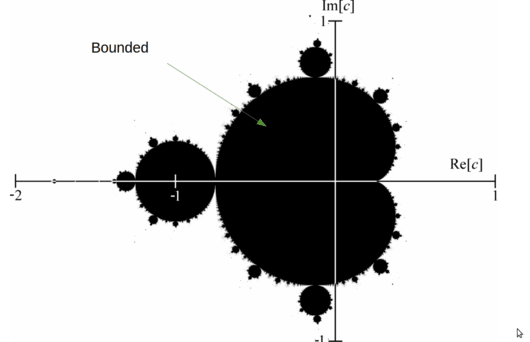

# Introduction to the Mathematics of the Mandelbrot Set

The Mandelbrot set ([Mandelbrot1980](#mandelbrot1980)) was discovered by Benoît B. Mandelbrot in the late 1970s and is considered a revolutionary development in mathematics due to its intricate and infinitely complex structure. This set, visualized using complex numbers, exhibits self-similarity and fractal boundaries. The visualization of the Mandelbrot set using computer graphics sparked widespread fascination, showcasing the power of computers to render stunning, detailed images ([ScientificAmerican1985](#scientific-american-1985)). This intersection of mathematics and digital art played an important role in popularizing fractals and advancing computer graphics technology ([Barnsley1988Science](#barnsley-1988-science)). We will present the necessary mathematics to understand the set next.

*Figure 2: Scientific American cover August 1985.*

## Complex Numbers (the input)

A complex number is expressed in the form \( z = x + yi \), where:

- \( x \) is the *real part*,
- \( y \) is the *imaginary part*, and
- \( i \) is the imaginary unit, defined by \( i^2 = -1 \).

For instance, \( 3 + 4i \) is a complex number with a real part of 3 and an imaginary part of 4.

Complex numbers can be represented in Cartesian (real and imaginary parts) and polar (magnitude and angle) forms.

*Figure 3: Geometric representation of the complex number \( z = x + yi \) in the complex plane (source: Wikipedia).*

## The Mandelbrot Iteration (the output)

The Mandelbrot set is defined by iterating the function:

\[
    z_{n+1} = z_n^2 + c
\]

Here, \( c \) is a complex number representing a point in the complex plane, and we start with \( z_0 = 0 \) (i.e., \( z_0 = 0 + 0i \)).

The iteration proceeds as follows:

1. Begin with \( z_0 = 0 \).
2. Compute \( z_1 = z_0^2 + c \).
3. Continue iterating: \( z_{n+1} = z_n^2 + c \).

The main question is: *Does the sequence remain bounded, or does it escape to infinity?*

## Determining Membership in the Mandelbrot Set

A point \( c \) belongs to the Mandelbrot set if, starting from \( z_0 = 0 \), the sequence \( |z_n| \) (the magnitude of \( z_n \)) does not tend to infinity as \( n \) increases. In practical terms, if at any iteration \( |z_n| > 2 \), the sequence will diverge, and the point \( c \) is not in the Mandelbrot set.

To visualize the Mandelbrot set, we plot points on the complex plane and color them based on the number of iterations required for \( |z_n| \) to exceed 2. Points that do not escape are usually colored black, indicating they are part of the Mandelbrot set.

### Example 1: A Number that iterates a lot (belongs to the Mandelbrot set and is colored by a single color)

Consider \( c = -0.5 + 0.5i \).

We will compute the first few iterations starting from \( z_0 = 0 \):

- \( z_0 = 0 \)
- \( z_1 = z_0^2 + c = 0^2 + (-0.5 + 0.5i) = -0.5 + 0.5i \)
- \( z_2 = z_1^2 + c \)

\[
z_2 = (-0.5 + 0.5i)^2 + (-0.5 + 0.5i)
= (0.25 - 0.5i - 0.25) + (-0.5 + 0.5i)
= -0.5 + 0.5i
\]

- \( z_3 = z_2^2 + c \)

\[
z_3 = (-0.5 + 0.5i)^2 + (-0.5 + 0.5i)
= -0.5 + 0.5i
\]

It appears that \( z_n \) converges to the same value and does not escape to infinity. For \( c = -0.5 + 0.5i \), the magnitude \( |z_n| \) does not exceed 2 in these iterations, so \( c \) is likely to be in the Mandelbrot set. In other words, these points do not escape to infinity, and their iterations remain bounded. These are typically colored by a single color.

*Figure 4: Bounded region of the Mandelbrot set in complex plane coloured in black (source: Wikipedia).*

### Example 2: A Number that does not iterate a lot (does not belong to the Mandelbrot set and has a color range)

Consider \( c = 1 \).

We will compute the iterations starting from \( z_0 = 0 \):

- \( z_0 = 0 \)
- \( z_1 = z_0^2 + c = 0^2 + 1 = 1 \)
- \( z_2 = z_1^2 + c = 1^2 + 1 = 2 \)
- \( z_3 = z_2^2 + c = 2^2 + 1 = 5 \)

Here, \( |z_2| = 2 \), and at \( n = 3 \), \( |z_3| = 5 \), which is already greater than 2. The sequence diverges quickly. Therefore, \( c = 1 \) does not belong to the Mandelbrot set. These points are colored based on how quickly they escape to infinity. The color often represents the number of iterations it takes for \( |z_n| \) to exceed a certain threshold, which is set to 2.

*Figure 5: Unbounded region of the set in the complex plane, with color shading representing the iteration count (source: Wikipedia).*

## Useful Terms and Concepts

To understand the Mandelbrot set and its computation, it's essential to grasp several key mathematical ideas. The terms outlined here can be explored further in references ([Barnsley1988](#barnsley1988), [Steeb2014](#steeb2014), [Kaye2008](#kaye2008)). Below is a brief introduction to the concepts required for understanding the set.

The Mandelbrot set is an example of *complex dynamics*, which involves studying how the iterative function

\[ 
z_{n+1} = z_n^2 + c 
\]

behaves when applied to complex numbers \( c \). The Mandelbrot set itself consists of all complex numbers \( c \) (which we compute in a grid) for which this iterative process does not cause values to grow infinitely large.

A key term in this process is the *escape radius*. The escape radius helps determine whether a point \( z \) will eventually "escape" to infinity during iteration. Typically, an escape radius of 2 is used. If the magnitude of \( z \) exceeds this value, the point is considered to be escaping to infinity. This helps in deciding whether the corresponding complex number \( c \) is part of the Mandelbrot set.

When visualizing the Mandelbrot set, two concepts are critical: *iteration count* and *color mapping*. The iteration count refers to how many iterations it takes for the magnitude of \( z \) to exceed the escape radius. This count forms the basis for color mapping, which assigns colors based on the number of iterations needed for escape. This technique visually reveals the Mandelbrot set's structure by illustrating the patterns that emerge as points escape at different rates.

Another important concept is whether a sequence is *bounded* or *unbounded*. A bounded sequence remains within a certain distance from the origin, indicating that \( c \) is part of the Mandelbrot set. An unbounded sequence escapes to infinity, meaning \( c \) is not part of the set. The rate of escape provides insight into the set’s intricate details.

---

**References**

1. Mandelbrot, B. B. (1980). *The Fractal Geometry of Nature*. New York: W.H. Freeman and Co.
2. Scientific American. (1985). *Fractals: The Patterns of Chaos*. Scientific American.
3. Barnsley, M. F. (1988). *Fractals Everywhere*. Academic Press, Inc.
4. Steeb, W.-H. (2014). *Nonlinear Dynamics and Chaos: Geometrical Methods*. World Scientific Publishing.
5. Kaye, M. (2008). *Random Fractals: Theory and Applications*. Springer.
