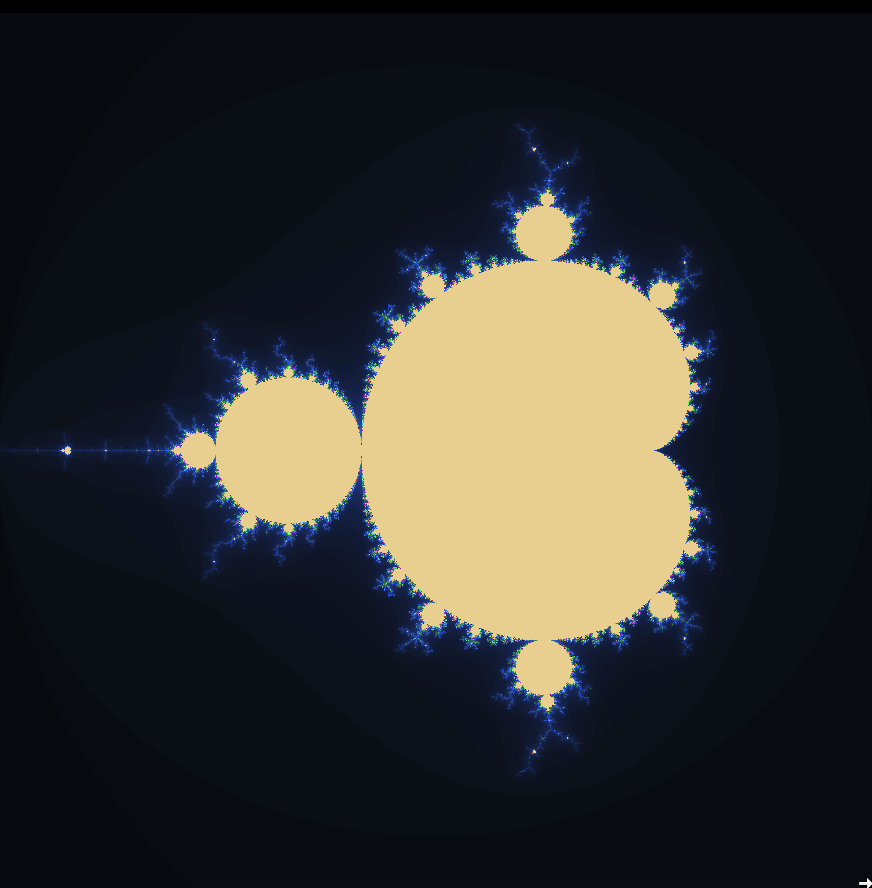

# Single-Threaded version

We start with the single-threaded version. This code executes the computation of the Mandelbrot set sequentially, processing each pixel one after the other without using concurrent execution or synchronization. This C++ code generates and saves a visualization of the Mandelbrot set for a given pixel grid (in this case \(1000 \times 1000\)). The `computeMandelbrot` function iterates over each pixel, calculating how many iterations it takes for the complex function \(z = z^2 + c\) to escape a defined boundary (magnitude greater than 2), storing the iteration counts in a vector.

After we generate the Mandelbrot set, the `save_ppm` function writes the resulting iteration data to a PPM file, which enables us to visualize the set directly. We will cover each section of the code one by one, explaining the main tools and techniques used.


```cpp
#include <iostream>
#include <complex>
#include <fstream>
#include <vector>
#include <chrono>//used to calculate time of execution
#include <thread>// used later for multithreading

constexpr int X  = 1000;       // X  of the image (pixels)
constexpr int Y  = 1000;      // Y  of the image(pixels)
constexpr int MAX_ITER = 1000;   // Maximum number of iterations
//This values are the constants according to the set (reference books)
constexpr double X_MIN = -2.0;   // Minimum x-axis value
constexpr double X_MAX = 1.0;    // Maximum x-axis value
constexpr double Y_MIN = -1.5;   // Minimum y-axis value
constexpr double Y_MAX = 1.5;    // Maximum y-axis value


// Function to compute the Mandelbrot set
    std::vector<int> computeMandelbrot() {
    std::vector<int> iterations(X  * Y );

// This corresponds to the chrono library. We start the execution time.
    double total_scaling_time = 0.0;
    double total_iteration_time = 0.0;

// outer loops runs through each row y and the inner loop runs through each column x.
    for (int y = 0; y < Y ; ++y) {
        for (int x = 0; x < X ; ++x) {
            auto start_scaling = std::chrono::high_resolution_clock::now();//start taking time
            double real = X_MIN + (X_MAX - X_MIN) * x / (X  - 1);
            double imag = Y_MIN + (Y_MAX - Y_MIN) * y / (Y  - 1);

            // creation of a complex number mapped into the pixel (x,y)
            std::complex<double> c(real, imag);
            // z starts from zero as defined by the algorithmus.
            std::complex<double> z(0.0, 0.0);
            auto end_scaling = std::chrono::high_resolution_clock::now();//stop taking time
                        // display of the total time of this section
            total_scaling_time += std::chrono::duration_cast<std::chrono::microseconds>(end_scaling - start_scaling).count() / 1e6;
            // declaration of the iteration number: iter
            int iter;
            auto start_iteration = std::chrono::high_resolution_clock::now();//start taking time

            for (iter = 0; iter < MAX_ITER; ++iter) {
                // the magnitude of z=2 is fixed.
                if (std::abs(z) > 2.0) break;

                z = z * z + c;
            }
            auto end_iteration = std::chrono::high_resolution_clock::now();//stop taking time
            // display of the total time of this section
            total_iteration_time += std::chrono::duration_cast<std::chrono::microseconds>(end_iteration - start_iteration).count() / 1e6;


            iterations[y * X  + x] = iter;
        }
    }
    // Give the the total scaling and iteration time.
    std::cout << "Total scaling time: " << total_scaling_time << " seconds" << std::endl;
    std::cout << "Total iteration time: " << total_iteration_time << " seconds" << std::endl;
    // Give the iterations counts for each pixel in the image.
    return iterations;
}

// Function to save the Mandelbrot set to a PPM image file with gradient coloring.
void save_ppm(const std::vector<int>& iterations, const std::string& filename) {
    std::ofstream ofs(filename, std::ios::binary);

    ofs << "P6\n" << X  << " " << Y  << "\n255\n";

    for (int i = 0; i < X  * Y ; ++i) {
        int iter = iterations[i];
        // Map iteration count to a color using a smooth gradient
        unsigned char r = static_cast<unsigned char>(iter % 256);
        unsigned char g = static_cast<unsigned char>((iter *2) % 256);
        unsigned char b = static_cast<unsigned char>((iter *5) % 256);
        ofs << r << g << b;
    }

    ofs.close();
}


// We call the function to compute the Mandelbrot set along with time measurements. Execution begins.
int main() {

    std::cout << "Width of the image:" << X << std::endl;
    std::cout << "Height of the image: " << Y << std::endl;

    auto start_compute = std::chrono::high_resolution_clock::now();
    std::vector<int> iterations = computeMandelbrot();
    auto end_compute = std::chrono::high_resolution_clock::now();
    std::chrono::duration<double> elapsed_compute = end_compute - start_compute;
    std::cout << "Total time taken to compute the Mandelbrot set (single-threaded version): " << elapsed_compute.count() << " seconds" << std::endl;

    int num_cpus = std::thread::hardware_concurrency();
    std::cout << "Number of CPUs used: " << num_cpus << std::endl;

    auto start_save = std::chrono::high_resolution_clock::now();
    //Save results
    //We call the function to save iterations in PPM format.
    save_ppm(iterations, "mandelbrot_gradient.ppm");
    auto end_save = std::chrono::high_resolution_clock::now();
    std::chrono::duration<double> elapsed_save = end_save - start_save;
    std::cout << "Total time it takes to generate image: " << elapsed_save.count() << " seconds" << std::endl;

    std::cout << "Mandelbrot set with colormap: mandelbrot_gradient.ppm" << std::endl;

    return 0;
}
```

## The Header

We start by defining the header we introduce in the code. The specific commands in example snippets will be explained later in the next subsection in the body of the code. These are just examples to get you a feel of what the headers provide.


```cpp
#include <iostream>
#include <complex>
#include <fstream>
#include <vector>
#include <chrono> // Used to calculate execution time
#include <thread> // Used later for multithreading
```


The `<iostream>` header manages standard input/output streams, like `std::cout` for printing to the console. Here is an example of the famous "Hello, World!".

```cpp
#include <iostream>

int main() {
    std::cout << "Hello, World!" << std::endl; // Outputs visible in the console
    return 0;
}
```

The `<complex>` header allows you to work with complex numbers, which is what we will need in this code. Complex numbers have both a real and an imaginary part. Here is an example where we create a complex number and display it.

```cpp
#include <iostream>
#include <complex>

int main() {
    std::complex<double> num(3.0, 4.0); // Create a complex number for example 3 + 4i
    std::cout << "Real part: " << num.real() << ", Imaginary part: " << num.imag() << std::endl;
    return 0;
}
```


## Definition of constants

```cpp
constexpr int X  = 1000;      
constexpr int Y  = 1000;      
constexpr int MAX_ITER = 1000;   
constexpr double X_MIN = -2.0;   
constexpr double X_MAX = 1.0;    
constexpr double Y_MIN = -1.5;   
constexpr double Y_MAX = 1.5;    
```

The `constexpr` keyword is used to define variables, functions, and constructors that can be calculated when the code is compiled. This means the compiler finds their values while creating the program, not while it is running. This enables the compiler to make the code run faster.


- `X` and `Y`: Define the dimensions of the output image in pixels, such as width and height.
- `MAX_ITER`: The maximum number of iterations for checking the divergence of the sequence in the Mandelbrot formula.
- `X_MIN`, `X_MAX`, `Y_MIN`, `Y_MAX`: Define the range of the complex plane to be visualized.

This is a simple example of a code that you can compile and run with the defined constants.

```cpp
#include <iostream>

constexpr int WIDTH = 640;
constexpr int HEIGHT = 480;

int main() {
    std::cout << "Image dimensions: " << WIDTH << "x" << HEIGHT << std::endl;

    return 0;
}
```

## Mandelbrot set computation function


This section contains the main function responsible for computing the Mandelbrot set once we have carried out the first steps introduced earlier. If you take a closer look, you will find the equation \( z = z \cdot z + c \) from the Mandelbrot set definition defined earlier. To enable the computer to execute this equation and generate an image based on the number of iterations, we will use nested loops along with various `C++` features and commands.

What we want to do here is to compute the Mandelbrot set by iterating over each pixel of a 2D image grid sized \(X \times Y\). For each pixel, we map its coordinates to a corresponding point in the complex plane. This involves scaling the pixel coordinates to fit within the specified range of the complex plane (from `X_MIN` to `X_MAX` for the real part and from `Y_MIN` to `Y_MAX` for the imaginary part). 

For each point in the complex plane, we then iterate the Mandelbrot formula:
\[ z = z^2 + c \]
starting from \(z = 0\), and continue until either the magnitude of \(z\) exceeds 2 or the maximum number of iterations (`MAX_ITER`) is reached. The number of iterations required for the magnitude of \(z\) to exceed 2 is recorded for each pixel. The iteration counts for all pixels are stored in a vector and returned for further use, which will be used to generate the image.

We are now showing this section of the code and will break down one-by-one the main tools and techniques used.


```cpp
   std::vector<int> computeMandelbrot() {
    std::vector<int> iterations(X  * Y );

// This corresponds to the chrono library. We start the execution time.
    double total_scaling_time = 0.0;
    double total_iteration_time = 0.0;

// outer loops runs through each row y and the inner loop runs through each column x.
    for (int y = 0; y < Y ; ++y) {
        for (int x = 0; x < X ; ++x) {
            auto start_scaling = std::chrono::high_resolution_clock::now();//start taking time
            double real = X_MIN + (X_MAX - X_MIN) * x / (X  - 1);
            double imag = Y_MIN + (Y_MAX - Y_MIN) * y / (Y  - 1);

            // creation of a complex number mapped into the pixel (x,y)
            std::complex<double> c(real, imag);
            // z starts from zero as defined by the algorithmus.
            std::complex<double> z(0.0, 0.0);
            auto end_scaling = std::chrono::high_resolution_clock::now();//stop taking time
                        // display of the total time of this section
            total_scaling_time += std::chrono::duration_cast<std::chrono::microseconds>(end_scaling - start_scaling).count() / 1e6;
            // declaration of the iteration number: iter
            int iter;
            auto start_iteration = std::chrono::high_resolution_clock::now();//start taking time

            for (iter = 0; iter < MAX_ITER; ++iter) {
                // the magnitude of z=2 is fixed.
                if (std::abs(z) > 2.0) break;

                z = z * z + c;
            }
            auto end_iteration = std::chrono::high_resolution_clock::now();//stop taking time
            // display of the total time of this section
            total_iteration_time += std::chrono::duration_cast<std::chrono::microseconds>(end_iteration - start_iteration).count() / 1e6;


            iterations[y * X  + x] = iter;
        }
    }
    // Give the the total scaling and iteration time.
    std::cout << "Total scaling time: " << total_scaling_time << " seconds" << std::endl;
    std::cout << "Total iteration time: " << total_iteration_time << " seconds" << std::endl;
    // Give the iterations counts for each pixel in the image.
    return iterations;
}
```
**The main function definition:** Let's start with the first section of the function.

```cpp
std::vector<int> computeMandelbrot() {
    // Body of the function  
}
```

`computeMandelbrot()` is function in which its main goal is to return a vector `std::vector<int>`, where the number of `iterations` for each pixel in the Mandelbrot set visualization to determine whether the corresponding point in the complex plane belongs to the Mandelbrot set will be stored. `std::vector<int>` dynamically allocates memory based on the image size (*X* * *Y* pixels). This is the main function that will be used by the caller directly without giving any further input in the parameters. For this reason, we use an empty `()`. At this point, this is all the information the caller will know and use. This is one of the main features of `C++` called encapsulation. All the further details will be handled inside the function.


**Initialisation and declaration of the variables:** 
Once we declared the function, we continue with the declaration of the local variables that we will use.

```cpp
std::vector<int> computeMandelbrot() {
    std::vector<int> iterations(X * Y);
    // Body of the function
    return iterations;
}
```


The vector `iterations` is initialized and declared with a fixed size based on the dimensions \(X \times Y\). Using `std::vector` enables flexible, dynamic memory management, allowing the program to handle different image sizes without knowing the dimensions when you compile the code. Since every pixel in the image requires a corresponding iteration count, the vector `iterations` must have \(X \times Y\) elements to store the results. This ensures that the vector can hold exactly one value for each pixel in the image grid. After the entire Mandelbrot set has been computed and the `iterations` vector is filled with the iteration counts for all the pixels, `return iterations;` is executed, and the function sends the `iterations` vector back to the caller.

**Outer loop over y (image height) and inner Loop over x (image width):** 

The main idea of the outer and inner loops is to iterate over every pixel in a 2D grid. The nested loop ensures that every pixel in the image is processed. Every `(x, y)` pair corresponds to a pixel in the image, which will be mapped to a complex number in the Mandelbrot domain of the set. `C++` is case sensitive, so note the difference between `x` and `X`.


```cpp
for (int y = 0; y < Y; ++y) {
    for (int x = 0; x < X; ++x) {
        // Body of the function
    }
}
```

Here, `int y = 0; y < Y; ++y` means the loop starts at `y = 0` (the first row) and increments `y` until it reaches `Y` (the total number of rows). The expression `++y` is the pre-increment operator. It increments the value of `y` by 1, then uses the updated value of `y` once the iteration loop is completed. It stops once `y == Y`. The same is valid for the inner loop using `x`. You can apply this straightforward loop configuration to all types of 2D grids or matrices to iterate over all the elements.


**Mapping image coordinates to complex plane:** 

Inside the nested loop, the Mandelbrot set is defined in the complex plane, which is defined using `real` and `imag`. For this reason, what we do next inside the nested loop is to map the image pixel coordinates `(x, y)` to a point in the complex plane.

```cpp
double real = X_MIN + (X_MAX - X_MIN) * x / (X - 1);
double imag = Y_MIN + (Y_MAX - Y_MIN) * y / (Y - 1);
```
`x / (X - 1)` and `y / (Y - 1)` are used to normalize the pixel coordinates (`x`, `y`), mapping them to a range from 0 to 1.

For example:  
When `x = 0`, `x / (X - 1)` becomes 0.  
When `x = X - 1` (the pixel at the right end), `x / (X - 1)` becomes 1. Exactly the same applies to `y`.  
The normalized values `x / (X - 1)` and `y / (Y - 1)` are scaled to the desired ranges. To perform this scaling, you take the normalized value and multiply it by the total range: `(X_MAX - X_MIN)` or `(Y_MAX - Y_MIN)`. After this is done, `X_MIN` or `Y_MIN` is added, respectively, to move the values to the correct location in the complex plane. Note that we use floating-point `double` precision to capture fine details.


**Creating complex number `c` and initializing `z`:** 

In order to compute iterative formula of the Mandelbrot set, we need to define its components as follows.


```cpp
std::complex<double> c(real, imag);
std::complex<double> z(0.0, 0.0);
```

where `c` is the complex number corresponding to the pixel (`x`, `y`). It is created using the previously calculated `real` and `imag` values. `z` is initialized to `0 + 0i` (the origin in the complex plane), as the formula indicates. Note that we use `std::complex<double>` which is a part of the C++ Standard Library, enabling us to represent and manipulate complex numbers.

**Initializing the iteration count and its loop:**  
We initialize `iter` to track how many iterations it takes for the complex number to escape (if it makes it at all). This loop is a core part of generating the Mandelbrot fractal. The final value of `iter` tells us whether the point escapes quickly or stays within the set, allowing us to color the corresponding pixel accordingly.

```cpp
int iter;
for (iter = 0; iter < MAX_ITER; ++iter) {
    if (std::abs(z) > 2.0) break;
    z = z * z + c;
}
```

Following the same structure used previously in the nested loops, this is a loop that runs up to a maximum number of iterations (`MAX_ITER`), incrementing `iter` by 1 on each pass. The difference here, however, is that our loop has the condition `if (std::abs(z) > 2.0) break;`. This condition checks if the magnitude (absolute value) of the complex number `z` has exceeded 2. This complex number is the Mandelbrot iteration formula `z = z * z + c;`. If the magnitude of `z` becomes larger than 2, we "break" out of the loop early (stop iterating) because the point is guaranteed to "escape" and is not part of the Mandelbrot set, and it gets assigned a color based on how fast it escapes. The value 2 is the threshold. Points that never escape (they reach `MAX_ITER`) are considered part of the Mandelbrot set and get a fixed color.

**Storing the iteration count in the vector:**  
Outside of the iteration count loop, we proceed with storing the `iter` in the `iterations` vector defined at the beginning of this function.


```cpp
iterations[y * X + x] = iter;
```
We use this statement as a counter for each time that the code has to iterate over the pixel. This is a very useful and common technique to store the iterations in `1D` obtained from data in a grid. We need to work in one dimension because `std::vector<int>` is one-dimensional.

The `return iterations;` statement is used to return the `iterations` vector from the function `computeMandelbrot`. This vector has the values we need to use as contour values in the image.

**The `<chrono>` library to measure computing time:**  
The `chrono` library in `C++` is part of the standard library, and it is a tool that allows you to measure time intervals and manage durations in your programs.  
The following lines declare two variables, `total_scaling_time` and `total_iteration_time`, both of type `double`, and initialize them to `0.0`.


```cpp
double total_scaling_time = 0.0;
double total_iteration_time = 0.0;
```
This indicates that these variables will be used to store floating-point numbers (they can  represent decimal values) which are used in the time measurement.
Inside the nested loops,  these lines are used to measure the execution time of the section responsible for scaling pixel coordinates to the complex plane.

```cpp
auto start_scaling = std::chrono::high_resolution_clock::now(); // start taking time
// Body of the scaling section
auto end_scaling = std::chrono::high_resolution_clock::now();   // stop taking time
```

The `std::chrono::high_resolution_clock` is part of the `chrono` library and provides a high-resolution timer. The `auto` keyword lets the compiler figure out the type of a variable based on what you assign to it. Here, `start_scaling` and `end_scaling` will be of type `std::chrono::high_resolution_clock::time_point`, which is used to represent a specific moment in time.

The following line serves to calculate the overall duration of the scaling and accumulates this time in `total_scaling_time`.

```cpp
total_scaling_time += std::chrono::duration_cast<std::chrono::microseconds>(end_scaling - start_scaling).count() / 1e6;
```
This part calculates the elapsed time between two points in the program: `start_scaling` and `end_scaling`. Both `start_scaling` and `end_scaling` are of type `std::chrono::high_resolution_clock::time_point`, which represents a point in time. The result of this subtraction is a `std::chrono::duration`. The `duration_cast` function converts the calculated duration into a specific duration type—in this case, microseconds (`std::chrono::microseconds`). The `count()` method gets the number that represents the duration in microseconds. To display the results in seconds, we need, however, to divide it by `1e6`. Finally, the result from the above calculations (the time in seconds) is added to the variable `total_scaling_time`. Note that the operator `+=` in the expression is used for accumulating values, which is equivalent to this:

```cpp
total_scaling_time = total_scaling_time + (calculated_time);
```
Outside of the nested loop, this measure is display as follows,
```cpp
std::cout << "Total scaling time: " << total_scaling_time << " seconds" << std::endl;
```
Exactly the same procedure is repeated in the iteration section.


## Saving to PPM (image) function

The function `save_ppm` is responsible for saving the results of the Mandelbrot set computation to a PPM (Portable Pixmap) image file with gradient coloring. We use this format because it does not require any additional installation (unlike PNG, JPG, and others).

```cpp
void saveToPPM(const std::vector<int>& iterations, const std::string& filename) {
    std::ofstream ofs(filename, std::ios::binary);

    ofs << "P6\n" << X  << " " << Y  << "\n255\n";

    for (int i = 0; i < X  * Y ; ++i) {
        int iter = iterations[i];
        // Map iteration count to a color using a smooth gradient
        unsigned char r = static_cast<unsigned char>(iter % 256);
        unsigned char g = static_cast<unsigned char>((iter *2) % 256);
        unsigned char b = static_cast<unsigned char>((iter *5) % 256);
        ofs << r << g << b;
    }

    ofs.close();
}
```

**Function and input Parameters:**  
The return type `void` indicates that this function does not return any value. What we want to do here is an action (saving an image) without providing any data back to the caller; for this reason, it is the appropriate option.

```cpp
void save_ppm(const std::vector<int>& iterations, const std::string& filename) {
        // Body of the function
}
```

The parameter `const std::vector<int>& iterations` inside the function represents the data to be saved, specifically a vector (`std::vector<int>`) of iteration counts for each pixel in the Mandelbrot set. It is passed by constant reference (`const &`). This means that `const` indicates that the data inside the vector cannot be modified by the function and `&` (reference) means that instead of passing a copy of the vector, a reference is passed, avoiding unnecessary duplication and saving memory, reducing overhead. What we mean by overhead is the additional computations, allocations, or operations that do not contribute directly to the primary functionality of the code, affecting performance and efficiency.

The parameter `const std::string& filename` represents the name of the file to which the Mandelbrot set image will be saved. Note that including `filename` makes it clear what the function is intended to do. Also, if you were to pass the filename as a regular `std::string` (by value without the `&`), the function would make a copy of that string; for this reason, we keep passing by reference as well.

**Opening the output file:**  
Once we go inside the function, `std::ofstream ofs` creates a file stream to write data to the specified file which in this case is `filename`. The flag `std::ios::binary` opens the file in binary mode and ensures the data is written in raw binary format, which is important for image files.

```cpp
std::ofstream ofs(filename, std::ios::binary);
```


`std::ofstream` stands for output file stream, which is a class in the `<fstream>` library designed to handle writing to files. `ofs` is the name of the `std::ofstream` object we are creating. The binary mode of `std::ios::binary` is important here. For an image file like a PPM file (which contains pixel data), you don't want any translation; what you want is the exact binary data written to the file. The default option is text mode, and this might convert certain characters to make them more readable or conform to your specific platform.

**Writing the PPM header:**  
The main purpose of the following line is to write the header of a PPM image file in the P6 format. The header is a block of metadata (format type, dimensions, color range) placed at the beginning of a file that contains important information about the file's contents. The PPM format supports two variations: P3 (ASCII mode) and P6 (binary mode). P6 format stores the pixel data in binary, making it compact and efficient to read/write.

```cpp
 ofs << "P6\n" << X << " " << Y << "\n255\n";
```


Here, `ofs << "P6\n"` writes the string `"P6\n"` to the file stream `ofs`. `"P6"` specifies that the file format is PPM in binary mode. `\n` represents a newline character. This ensures that each part of the header appears on its own line as required by the PPM format specification.

`ofs << "P6\n" << X << " " << Y << "\n255\n"` writes the image dimensions (width and height) to the file. `ofs << "\n255\n"` specifies the maximum color value, 255, for 8-bit color channels. An example of the P6 format header containing these three specifications can be shown as follows:

```
P6
5000 5000
255
```

**Writing the pixel data and closing:** 

This section of the code is responsible for writing the computed set to an image file (in PPM format). The following loop transforms the computed iteration counts into color values (red, green, and blue components) for each pixel. 

```cpp
    for (int i = 0; i < X  * Y ; ++i) {
        int iter = iterations[i];
        unsigned char r = static_cast<unsigned char>(iter % 256);
        unsigned char g = static_cast<unsigned char>((iter *2) % 256);
        unsigned char b = static_cast<unsigned char>((iter *5) % 256);
        ofs << r << g << b;
    }
    ofs.close();
```

`for (int i = 0; i < X * Y; ++i)` is a for loop that iterates over every pixel in the image. The image has `X * Y` pixels, where `X` is the width and `Y` is the height. `i` is the loop counter, running from `0` to `X * Y - 1` (inclusive). The choice of `X * Y - 1` ensures that the loop correctly iterates through all pixel indices in a zero-based indexing system.

`int iter = iterations[i];`: Here, `iter` is the number of iterations (from the Mandelbrot computation) for the pixel at position `i`. `iterations` is a vector that stores the iteration count for every pixel, so `iterations[i]` gives the number of iterations required for the pixel at position `i` to either converge or diverge. Note that we have given the same name `iter`. While we have used this name before in `computeMandelbrot()`, they exist in different contexts. The one in `computeMandelbrot()` counts the iterations during the computation of the Mandelbrot set, while the one in `save_ppm()` retrieves the precomputed iteration count to create an image.


This line of code calculates the red (r) component of a color based on the iteration count. `iter % 256` takes the iteration count `iter` and applies the modulo operator. It ensures that the resulting value is within the range of 0 to 255. This is important because RGB color channels can only represent values within this range. The result of `iter % 256` is then converted to an `unsigned char`. An `unsigned char` is an 8-bit integer type that can store values from 0 to 255.
```cpp
        unsigned char r = static_cast<unsigned char>(iter % 256);
```


This line calculates the green (g) component of the color by first multiplying `iter` by 2. The result is then taken modulo 256, ensuring that the value remains within the range of 0 to 255. This is important because the green color component must fit within this range to be valid for RGB representation in image files.

```cpp
        unsigned char g = static_cast<unsigned char>((iter *2) % 256);
```

This line calculates the blue (b) component of the color by multiplying `iter` by 5 and then taking the result modulo 256. By using different multipliers (1 for red, 2 for green, and 5 for blue), the red, green and blue components are assigned different patterns of intensity. This creates a gradient effect in the final image.


```cpp
        unsigned char b = static_cast<unsigned char>((iter *5) % 256);
```


`ofs << r << g << b;`: `ofs` is the output file stream (an `std::ofstream` object) that was opened to write binary data to the PPM image file. This line writes the red (`r`), green (`g`), and blue (`b`) color values for the current pixel to the file. Each pixel in the image is represented by three consecutive bytes: one for red, one for green, and one for blue. This line outputs those bytes in binary format.

Once the loop finishes writing all the pixel data, the file stream is closed with `ofs.close();`. This ensures that all data is properly written to the file and the file is saved correctly. If this is not done, some of this data might not be written, leading to a corrupted or incomplete file, and the file might not be readable by other programs.


## The caller function

The caller function in C++ serves as the entry point for any program. It is where the execution starts and where the tasks are managed. The `main` function is the designated entry point for any `C++` program.

```cpp
int main() {

    std::cout << "Width of the image:" << X << std::endl;
    std::cout << "Height of the image: " << Y << std::endl;

    auto start_compute = std::chrono::high_resolution_clock::now();
    std::vector<int> iterations = computeMandelbrot();
    auto end_compute = std::chrono::high_resolution_clock::now();
    std::chrono::duration<double> elapsed_compute = end_compute - start_compute;
    std::cout << "Total time taken to compute the Mandelbrot set (single-threaded version): " << elapsed_compute.count() << " seconds" << std::endl;

    int num_cpus = std::thread::hardware_concurrency();
    std::cout << "Number of CPUs used: " << num_cpus << std::endl;

    auto start_save = std::chrono::high_resolution_clock::now();
    saveToPPM(iterations, "mandelbrot_gradient.ppm");
    auto end_save = std::chrono::high_resolution_clock::now();
    std::chrono::duration<double> elapsed_save = end_save - start_save;
    std::cout << "Time it takes to generate image:  " << elapsed_save.count() << " seconds" << std::endl;

    std::cout << "Mandelbrot set with colormap: mandelbrot_gradient.ppm" << std::endl;

    return 0;
}
```

In `C++`, the name `main` cannot be changed. The return type `int` indicates that this function returns an integer value, which is 0 for successful execution.


```cpp
int main() {
    // List of execution orders
    return 0;
}      
```

**Calling `computeMandelbrot()`:**  
This line calls the function `computeMandelbrot()` and stores the returned vector of integers in the `iterations` variable.

```cpp
std::vector<int> iterations = computeMandelbrot();
```

**Saving the results:**  
Once `computeMandelbrot()` is executed, `save_ppm(iterations, "mandelbrot_gradient.ppm");` calls the `save_ppm` function, which takes the computed iterations and saves them in a PPM file format.

```cpp
save_ppm(iterations, "mandelbrot_gradient.ppm");
```


**Display dimensions, number of CPUs, output/confirmation messages and exit:**  
Display messages are important because the user of the code will have different requirements, and when the code is run, it is useful to read in the console the case that you are running. In this code, the dimensions of the image or grid are displayed as follows:

```cpp
std::cout << "Width of the image:" << X << std::endl;
std::cout << "Height of the image: " << Y << std::endl;
```

`Y`, which represents the width and height of the image, is printed along with descriptive text. `std::endl` adds a newline and ensures the output is shown immediately.

The following line informs the user how many CPU cores are detected. 
```cpp
int num_cpus = std::thread::hardware_concurrency();
std::cout << "Number of CPUs used: " << num_cpus << std::endl;
```

`std::thread::hardware_concurrency()` returns the number of threads the hardware supports. We will use `std::thread` extensively in the following section on Multithreading and Parallelism.

It is always good practice to output a message indicating that the code has run correctly. You will know that your code has no runtime issues up to this point if the message is displayed.

```cpp
std::cout << "Mandelbrot set with colormap: mandelbrot_gradient.ppm" << std::endl;
```

**Timing the `computeMandelbrot()` and the saving of results**

We measure in this function too the execution time here and obtain output in the console. This first and second group of lines measures the time taken to compute and save the computed Mandelbrot set to a file, respectiveley.


```cpp
auto start_compute = std::chrono::high_resolution_clock::now();
std::vector<int> iterations = computeMandelbrot();
auto end_compute = std::chrono::high_resolution_clock::now();
std::chrono::duration<double> elapsed_compute = end_compute - start_compute;
std::cout << "Total time taken to compute the Mandelbrot set (single-threaded version): " << elapsed_compute.count() << " seconds" << std::endl;
```
```cpp
auto start_save = std::chrono::high_resolution_clock::now();
saveToPPM(iterations, "mandelbrot_gradient.ppm");
auto end_save = std::chrono::high_resolution_clock::now();
std::chrono::duration<double> elapsed_save = end_save - start_save;
std::cout << "Total time it takes to generate image: " << elapsed_save.count() << " seconds" << std::endl;
```


## The output
We compile the code as follows.
```
 g++ -std=c++11 -o mandelbrot mandelbrot_set_exploration_main_code_general_single_threaded.cpp -pthread
```
Execute the command
```
 ./mandelbrot
```

Here, we print-out the total time spent on scaling coordinates and performing iterations.
```
Width of the image:5000
Height of the image: 5000
Total scaling time: 0.007769 seconds
Total iteration time: 275.241 seconds
Total time taken to compute the Mandelbrot set (single-threaded version): 288.617 seconds
Number of CPUs used: 12
Total time it takes to generate image: 6.57477 seconds
Mandelbrot set with colormap: mandelbrot_gradient.ppm
```

The following image corresponds to the output file.



*Figure: Mandelbrot set output.*


Below is a zoomed-in section of the image using ParaView which we will cover in the following section.


*Figure: Zommed-in section of the Mandelbrot set using ParaView.*

